# CycleGAN on Art Composition Attributes

Please read the accompanying blog post: [https://hollygrimm.com/acan_final](https://hollygrimm.com/acan_final)

## Results when training on Apple2Orange

1 | 2
------------ | -------------
python main.py -c params/harmony/analogous.json | python main.py -c params/harmony/complementary.json
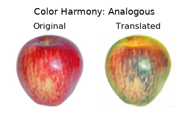 | 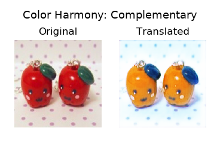
python main.py -c params/variety_color/1.json | python main.py -c params/variety_color/10.json
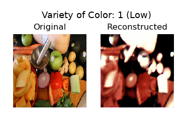 | 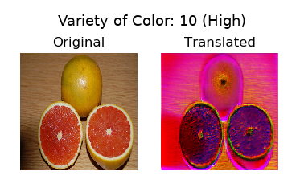
python main.py -c params/variety_texture/1.json | python main.py -c params/variety_texture/10.json
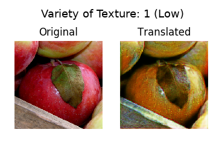 | 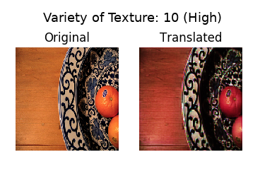
python main.py -c params/variety_shape/1.json | python main.py -c params/variety_shape/10.json
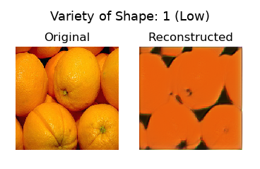 | 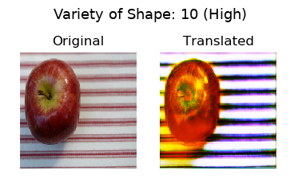
python main.py -c params/variety_size/1.json | python main.py -c params/variety_size/10.json
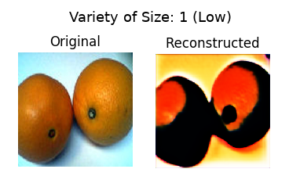 | 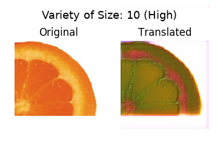
python main.py -c params/contrast/1.json | python main.py -c params/contrast/10.json
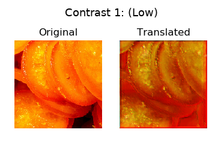 | 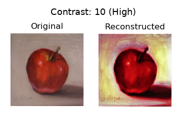
python main.py -c params/repetition/1.json | python main.py -c params/repetition/10.json
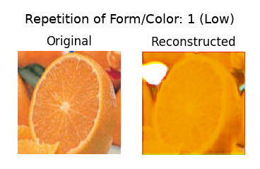 | 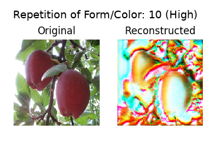
python main.py -c params/pri_color/blue-cyan.json | python main.py -c params/pri_color/green-yellow.json
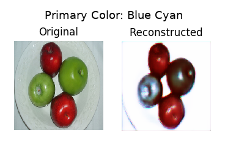 | 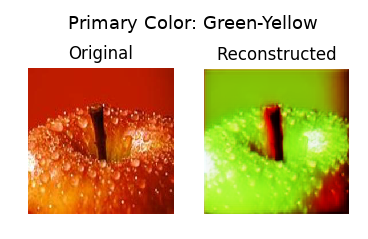

## Requirements

Error message 'ValueError: axes don't match array' during load_weights unless older version of Keras and keras-contrib installed. See https://stackoverflow.com/questions/51944836/keras-load-model-valueerror-axes-dont-match-array

* Keras
* keras-contrib
* pillow
* imageio
* pandas
* matplotlib
* sklearn
* Weights from https://github.com/hollygrimm/art-composition-cnn

## AWS Install
* Select Deep Learning AMI (Ubuntu) Version 14.0
* Instance Type `GPU Compute` such as p2.xlarge
* 125GB sda1

Connect to instance, copy contents of [aws-setup.sh](aws-setup.sh) to file in /home/ubuntu and run:
```
vi aws-setup.sh
chmod +x aws-setup.sh
./aws-setup.sh
```

## Manual Install
### keras-contrib install
```
source activate tensorflow_p36
git clone https://www.github.com/keras-team/keras-contrib.git
cd keras-contrib
python setup.py install
```

### Download Art Composition Attributes Network Weights
Weights can be downloaded with these commands:
```
wget --load-cookies /tmp/cookies.txt "https://docs.google.com/uc?export=download&confirm=$(wget --quiet --save-cookies /tmp/cookies.txt --keep-session-cookies --no-check-certificate 'https://docs.google.com/uc?export=download&id=1A1FvTA-n7EZrtLx7TD9q3KgF5khpAjVW' -O- | sed -rn 's/.*confirm=([0-9A-Za-z_]+).*/\1\n/p')&id=1A1FvTA-n7EZrtLx7TD9q3KgF5khpAjVW" -O art_composition_cnn_weights.hdf5 && rm -rf /tmp/cookies.txt

sha256sum d922aa82e6e67177915895e34f02e03e89a902d7a15914edcee0c3056f285d24
```

Or train your own weights using this repository: https://github.com/hollygrimm/art-composition-cnn

### Download Dataset
```
bash download_dataset.sh apple2orange
```

Minimum image size for training or predicting is 16x16 pixels (size of Patch-GAN patch). When training your own dataset, the number of images in the trainA folder, should be equal to or less than the number of images in trainB folder.

With a batch size of 1, here are the maximum image sizes that train on various GPU sizes:

| GPU        | Img Size    | Trains?  |
|:------------- |:-------------|:-----|
|2 GiB|320x320|No, OOM|
|2 GiB|256x256|Yes|
|12 GiB|1024x1024|No, OOM|
|12 GiB|768x768|Yes|
|16 GiB|1280x1280|No, OOM|
|16 GiB|1024x1024|Yes|

When running prediction, here are the maximum predict image sizes for various GPU sizes:

| GPU        | Predict Img Size    | Predicts? |
|:------------- |:-------------|:-----|
|2 GiB|1408x1408|No, OOM|
|2 GiB|1344x1344|Yes|
|12 GiB|4096x4096|No, OOM|
|12 GiB|4032x4032|Yes|
|16 GiB|4832x4832|No, OOM|
|16 GiB|4816x4816|Yes (a or b, not both)
|16 GiB|4800x4800|Yes (both)


## Run Training
```
source activate tensorflow_p36
cd cyclegan-keras-art-attrs/
python main.py -c input_params.json
```

## Run Predict

after training, update weights_path in input_params_predict.json

```
source activate tensorflow_p36
cd cyclegan-keras-art-attrs/
python predict.py -c input_params_predict.json
```

## Run Tests
```
cd tests
python cyclegan_keras_art_attrs_tests.py
```


## Acknowledgements

* Jun-Yan Zhu https://github.com/junyanz/CycleGAN
* Erik Linder-Norén https://github.com/eriklindernoren/Keras-GAN
* HagopB https://github.com/HagopB/cyclegan
* Ulyanov et al Instance Normalization: The Missing Ingredient for Fast Stylization https://arxiv.org/pdf/1607.08022.pdf
* Ahmed Hamada Mohamed Kamel El-Hinidy https://github.com/Ahmkel/Keras-Project-Template


